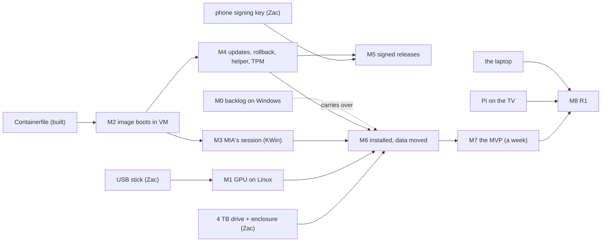

# MIA OS: what depends on what (Prompt 16)

*Claude (Opus), 2026-11-18.*

```mermaid
flowchart LR
  USB["USB stick (Zac)"] --> M1["M1 GPU on Linux"]
  CF["Containerfile (built)"] --> M2["M2 image boots in VM"]
  M2 --> M3["M3 MIA's session (KWin)"]
  M2 --> M4["M4 updates, rollback, helper, TPM"]
  KEY["phone signing key (Zac)"] --> M5["M5 signed releases"]
  M4 --> M5
  DRIVE["4 TB drive + enclosure (Zac)"] --> M6["M6 installed, data moved"]
  M1 --> M6
  M3 --> M6
  M4 --> M6
  M6 --> M7["M7 the MVP (a week)"]
  M7 --> M8["M8 R1"]
  PI["Pi on the TV"] --> M8
  LAP["the laptop"] --> M8
  M0["M0 backlog on Windows"] -.carries over.-> M6
```

Every arrow from a box marked Zac is his hands-on step; nothing else on the critical path needs buying.
