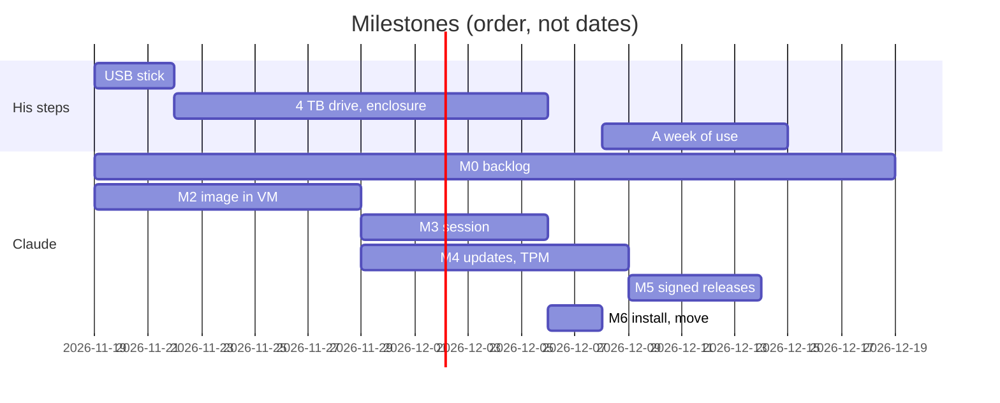
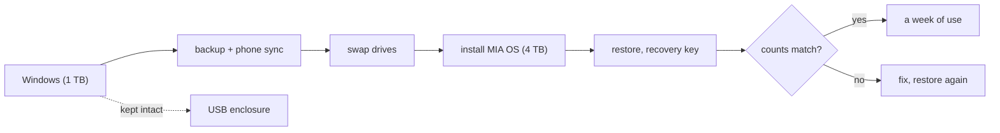

# MIA OS: roadmap diagrams (Prompt 16)

*Claude (Opus), 2026-11-18. Mermaid.*

## 1. Stages

```mermaid
flowchart LR
  S0["0 MIA on Windows (ongoing)"] --> S1["1 proofs"] --> S2["2 the image in a VM"] --> S3["3 the MVP on his PC"] --> S4["4 R1"] --> S5["5 beyond"]
```

## 2. Milestones and his steps

```mermaid
gantt
  dateFormat YYYY-MM-DD
  title Milestones (order, not dates)
  section His steps
  USB stick             :z1, 2026-11-19, 3d
  4 TB drive, enclosure :z2, after z1, 14d
  A week of use         :z3, after m6, 7d
  section Claude
  M0 backlog            :m0, 2026-11-19, 30d
  M2 image in VM        :m2, 2026-11-19, 10d
  M3 session            :m3, after m2, 7d
  M4 updates, TPM       :m4, after m2, 10d
  M5 signed releases    :m5, after m4, 5d
  M6 install, move      :m6, after z2, 2d
```

## 3. Migration

```mermaid
flowchart LR
  W["Windows (1 TB)"] --> B["backup + phone sync"] --> SW["swap drives"] --> I["install MIA OS (4 TB)"] --> R["restore, recovery key"] --> C{"counts match?"}
  C -->|yes| WEEK["a week of use"]
  C -->|no| FIX["fix, restore again"]
  W -.kept intact.-> ENC["USB enclosure"]
```
